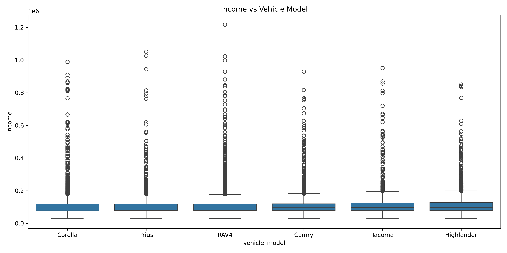
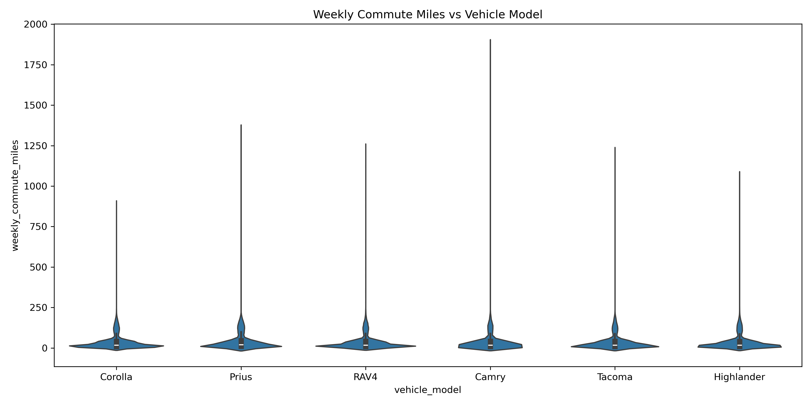

# Capstone Project: Predicting Customer Vehicle Purchase Preferences for a Toyota Dealership

## 1. Overview
The goal of this project is to predict which Toyota model (Camry, Corolla, Prius, RAV4, Tacoma, or Highlander) a potential customer is most likely to purchase based on demographic, behavioral, and financial characteristics. This enables the dealership to match inventory with demand, personalize recommendations, and improve sales efficiency.

---

## 2. Business Understanding
**Research Question:** How can a Toyota dealership predict which car model a potential customer is most likely to purchase?  

**Importance:** Accurate predictions help in inventory management, marketing targeting, and enhancing customer experience.

---

## 3. Data Understanding
The dataset contains:
- **Demographics:** Age, gender, income, occupation, family size
- **Behavioral Attributes:** Weekly commute distance, fuel preference, test-drive interest
- **Geographic Data:** ZIP code, median local income, urban/rural classification
- **Target:** `vehicle_model` (categorical)

### Missing Values

### Categorical Feature Unique Values
- **Occupation:** `'Retired'`, `'Manager'`, `'Teacher'`, `'Healthcare'`, `'Engineer'`, `'Sales'`, `'Other'`, `'Admin'`, `'Trades'`, `'Student'`, `'None'`
- **Gender:** `'Female'`, `'Male'`, `'Non-Binary'`, `'Prefer not to say'`
- **Fuel Preference:** `'Gasoline'`, `'Electric'`, `'Hybrid'`, `'No preference'`
- **Other categorical features:** `test_drive_interest`, `purchase_urgency`, `urban_rural`

*Note: Missing values in `occupation` were imputed as `"Unknown"` for modeling purposes.*

---

## 4. Data Preparation & Feature Engineering
- Numeric columns with missing values (`income`, `weekly_commute_miles`, `income_to_zip_ratio`) were imputed with **median**.
- Categorical columns (`occupation`, `fuel_preference`) were imputed with **constant values** ("Unknown" or "No preference").
- Cleaned whitespace in categorical variables.
- Derived features considered:  
  - `income_to_zip_ratio`  
  - `family_size` (can indicate single vs. family, potentially influencing car choice)  
  - `weekly_commute_miles`  

---

## 5. Exploratory Data Analysis (EDA)

### Vehicle Model Distribution

### Income vs Vehicle Model

### Weekly Commute vs Vehicle Model

### Fuel Preference vs Vehicle Model

---

## 6. Baseline Model
- **Model Used:** Random Forest Classifier  
- **Reason:** Handles numeric and categorical features, robust to non-linear relationships, provides feature importance.  
- **Evaluation Metric:** Accuracy (appropriate for balanced classification), supported by F1-score and confusion matrix.

### Baseline Model Performance
**Accuracy:** 0.2400

**Confusion Matrix:**

**Top 10 Feature Importances:**

| Feature                  | Importance |
|---------------------------|-----------|
| loyalty_score             | 0.115     |
| income                    | 0.114     |
| weekly_commute_miles      | 0.113     |
| income_to_zip_ratio       | 0.111     |
| age                       | 0.104     |
| median_zip_income         | 0.065     |
| family_size               | 0.040     |
| purchase_urgency_Browse   | 0.019     |
| purchase_urgency_3_months | 0.018     |
| gender_Female             | 0.018     |

*Interpretation:* Financial, behavioral, and demographic features (income, commute, loyalty score) have the highest impact on vehicle purchase prediction.

---

## 7. Summary & Next Steps
- The dataset is cleaned, duplicates removed, and missing values handled.
- Outlier analysis via boxplots and z-scores was performed (not included here for brevity).
- Feature engineering included derived ratios (`income_to_zip_ratio`) and behavioral insights (`family_size`, `weekly_commute_miles`).
- Baseline model shows moderate predictive power (accuracy 0.24).  
  - Improvement opportunities: hyperparameter tuning, additional features, or ensemble models.
- Visualizations provide insights into relationships between demographic/behavioral variables and vehicle choice.

