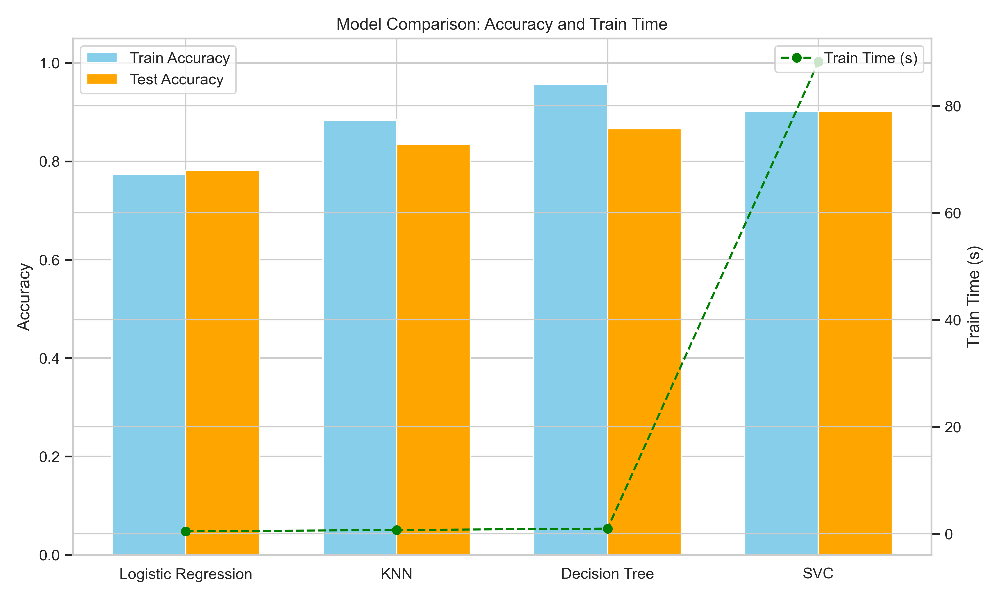
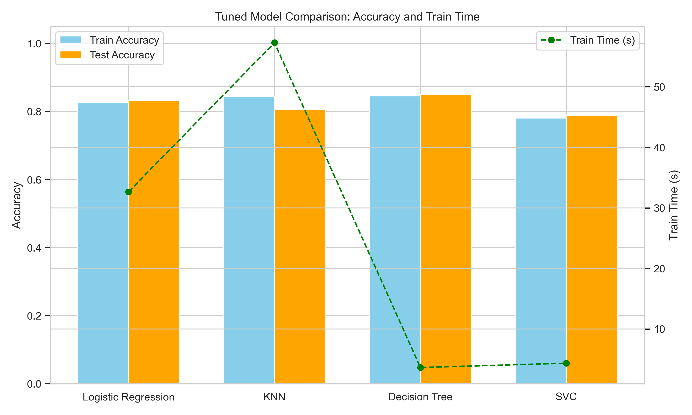
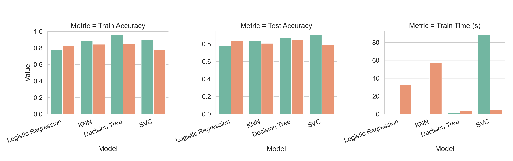

# 🎯 Practical Application III: Comparing Classifiers for Term Deposit Prediction

## Overview

This project is a systematic comparative study of four machine learning classification algorithms applied to a bank marketing dataset. The objective is to **predict whether a customer will subscribe to a bank term deposit** following a telephone marketing campaign.

The project evaluates:

* **K-Nearest Neighbors (KNN)**
* **Logistic Regression**
* **Decision Tree**
* **Support Vector Machine (SVC)**

The primary goal is to find the classifier that offers the best balance of predictive performance (prioritizing **F1-Score** due to data imbalance) and computational cost for real-world deployment.

---

## Business Objective

The business goal, as derived from the CRISP-DM methodology applied to the bank marketing campaign, is twofold:

1.  **Prediction:** To develop a robust predictive model that can accurately identify prospective clients who are likely to subscribe to a term deposit ('yes').
2.  **Efficiency:** To **increase the effectiveness and efficiency of future marketing campaigns** by using the model to pre-select and prioritize the most promising clients for contact. This minimizes costs and avoids wasting time on unlikely prospects.

The ultimate aim is to create a model that not only predicts success but also **explains the characteristics** that drive a client's decision to subscribe, providing actionable business intelligence.

---

## Data Source and Details

### Dataset Source
The data used for this analysis is the **Bank Marketing Data Set**, publicly available from the UCI Machine Learning Repository.

* **Source:** [UCI Bank Marketing Data Set](https://archive.ics.uci.edu/ml/datasets/bank+marketing)
* **Context:** Real-world data collected from direct marketing campaigns conducted by a Portuguese banking institution. The dataset represents the results of **multiple marketing campaigns** over a specific time frame.

### Key Data Characteristics
* **Target Variable:** `y` (Whether the client subscribed to the term deposit: 'yes' or 'no').
* **Challenge:** The dataset is highly **imbalanced**, meaning the number of clients who subscribed is significantly lower than those who did not. This challenge guided the focus toward metrics like **F1-Score** and **Recall**.
* **Features:** The dataset includes various client attributes (e.g., age, job, marital status, education) and details about the marketing contact (e.g., duration, month, day of week).

---

## Methodology Framework

The project followed a two-phase modeling approach:

1.  **Baseline Modeling (Default Parameters):** All four classifiers were trained using their out-of-the-box, **default hyperparameters** in `scikit-learn` to establish a performance benchmark.
2.  **Model Optimization (Tuned Parameters):** **Grid Search** was employed to fine-tune the hyperparameters of each model. The tuning objective was to **maximize the F1-Score** to ensure robust performance on the minority class (clients who subscribe to the deposit).
3.  **Evaluation:** Performance was evaluated using comparison charts and **Confusion Matrices** to understand model behavior (e.g., False Positives/Negatives).

---

## Model Performance Explanation

The following three visualizations illustrate the entire model development and evaluation process:

### 1. Initial Performance (Default Parameters)

This first chart shows the performance floor. All models were run with no manual tuning, providing a **baseline** to measure the effectiveness of the later optimization phase. The performance gaps between models here are due purely to their inherent mathematical strengths and weaknesses on the raw, pre-processed data.

---

### 2. Optimized Performance (Tuned Parameters)

This chart displays the best performance achieved by all four classifiers **after hyperparameter tuning**. This is the key comparison, showing each model at its most optimized state. Notice the general improvement in metrics (especially F1-Score) compared to the default baseline.

---

### 3. Comparison of Default vs. Tuned Models

This visualization directly compares the default performance of the models against their tuned performance. **The primary purpose of this chart is to quantify the value of hyperparameter optimization.** The magnitude of the difference between the 'Default' bar and the 'Tuned' bar for each model indicates how much was gained by finding the right parameters.

---

## Key Findings & Recommendation

Based on the comparative analysis:

* **Tuning Value:** Hyperparameter optimization significantly improved the **F1-Score** across the board, validating the two-phase approach.
* **Top Performance:** The **SVC (Tuned)** model achieved the highest overall metrics, but its complexity makes it computationally expensive.
* **Best Practical Model:** **Logistic Regression** delivered near-top performance in all key metrics while remaining computationally efficient and highly interpretable.

### Recommendation for the Bank

The **Logistic Regression** model is the recommended choice for deployment. It provides a high-performing and robust solution (demonstrated by its optimized F1-Score) with the added benefits of **interpretability** and **low computational cost**, making it easy to deploy and understand in a business environment.
