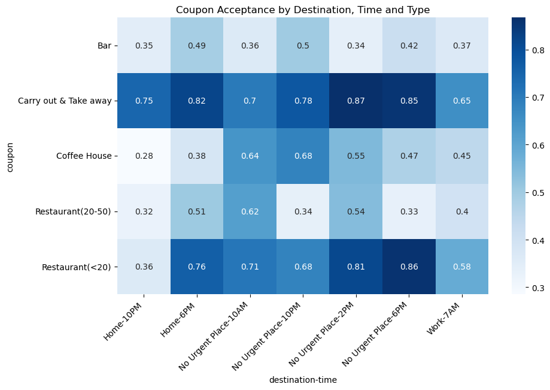
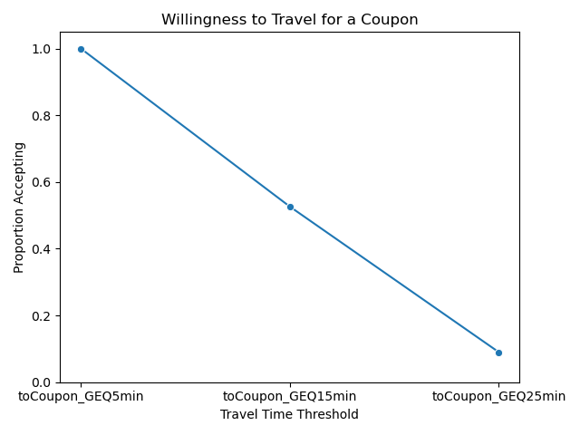
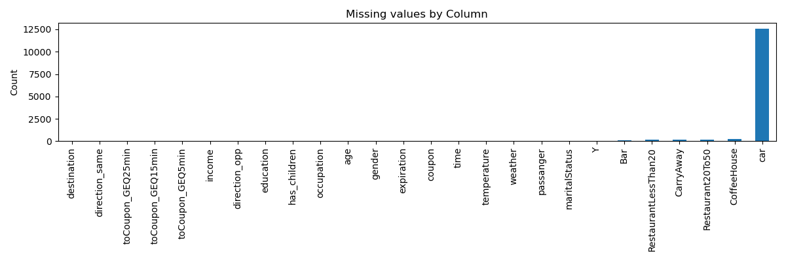
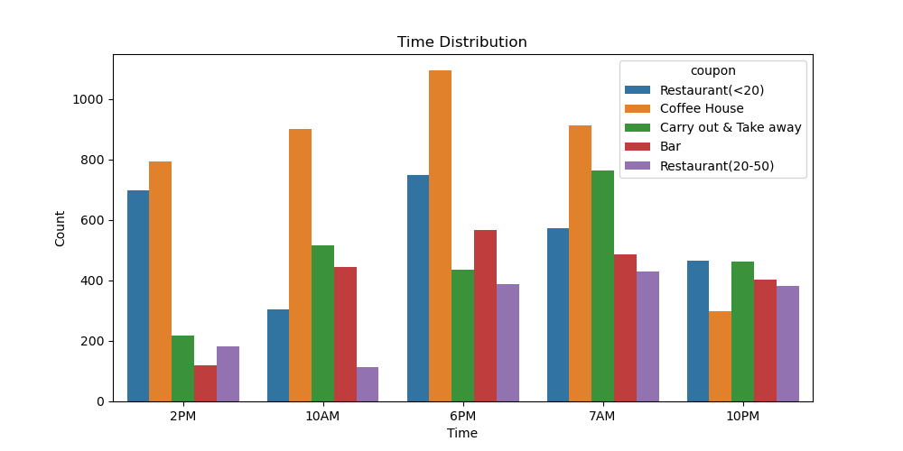
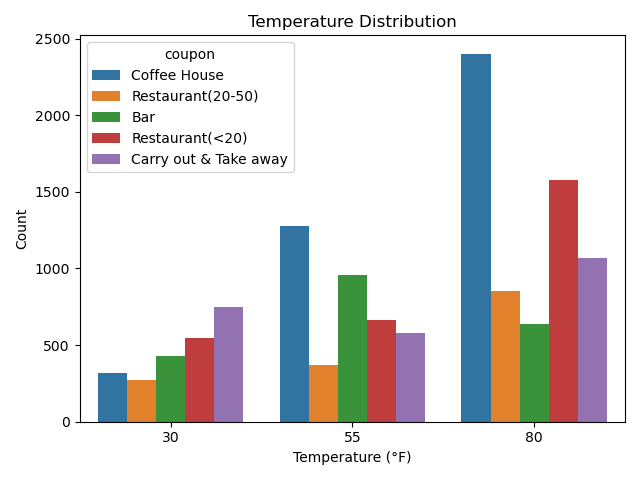
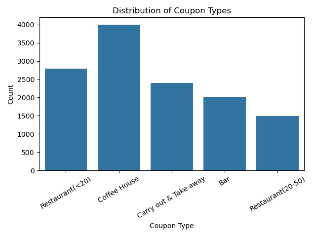

# Coupon Acceptance Analysis

## Project Overview

This project focuses on distinguishing between customers who accept and those who reject driving-related coupons. Using statistical visualizations and probability distributions, the analysis explores the influence of contextual variables—such as time, destination, weather, and companionship—on coupon acceptance behavior. The objective is to derive actionable, data-driven insights to support effective marketing strategies.

---

## Data Source

The dataset used in this project is obtained from the UCI Machine Learning Repository, based on survey responses collected via Amazon Mechanical Turk. Participants were presented with hypothetical driving scenarios and asked whether they would accept a coupon in each case.

### Response Categories

- **Accepted (Y = 1):** "Right away" or "Later, before the coupon expires"
- **Rejected (Y = 0):** "No, I do not want the coupon"

### Coupon Types Included

- Coffee House
- Carryout & Takeaway
- Bars
- Less Expensive Restaurants (under $20)
- More Expensive Restaurants ($20–$50)

---

## Deliverables

This repository includes the following components:

- **`prompt.ipynb`**: Jupyter Notebook containing code, exploratory data analysis, statistical summaries, and visualizations.
- **Dataset**: The raw data file used for the analysis, located in `data/coupons.csv`.
- **`README.md`**: This document, providing an overview of the project, methodology, key findings, and recommendations.

---

## Analysis Questions and Hypotheses

The analysis is guided by the following key questions and hypotheses:

- **Coupon Distribution**: What is the overall distribution of different coupon types in the dataset? How does the distribution of coupons offered change based on time and temperature?
- **Bar Coupon Acceptance**: Which age groups are more likely to accept bar-related coupons?
- **Coupons by Destination and Time**: How does acceptance vary depending on the customer’s destination and time of day?
- **Urgency Hypothesis**: Are customers more likely to accept coupons when they are not in a hurry (e.g., “No Urgent Place”) and during mealtimes (e.g., 2 PM, 6 PM)? It is hypothesized that carryout and less expensive restaurant coupons have higher acceptance under such conditions.
- **Weather Effects**: How do weather conditions, particularly **temperature**, impact the acceptance of specific coupon types, such as coffee house coupons?
- **Willingness to Travel**: What is the relationship between the distance a customer is willing to travel and the type of coupon offered?
- **Family Dinner Scenario**: What is the likelihood of accepting more expensive restaurant coupons when individuals are driving home with children around dinner time?

---

## Key Findings

The exploratory analysis produced several important insights, which are directly supported by the project's visualizations.

- **Coupon Acceptance Varies by Destination and Time**: The heatmap shows that acceptance rates for coupons are not uniform and are strongly influenced by the time and destination. **Coffee House** coupons have a high acceptance rate of **0.64** at **10 AM** and a surprisingly high **0.68** at **10 PM** when the destination is "No Urgent Place." Similarly, **Carryout & Takeaway** coupons are most popular during meal times, with high acceptance rates of **0.87** at **2 PM**, **0.82** at **6 PM** (on the way home), and **0.85** at **6 PM** (with no urgent destination).
- **Willingness to Travel Drops Sharply**: The line plot illustrates a strong negative correlation between a customer's willingness to travel and the acceptance of a coupon. The graph shows that the **proportion of people accepting a coupon decreases significantly** as the required travel time increases.
- **Data Quality is a Factor**: The bar chart shows that while most columns are complete, there are some with missing values. The chart provides a crucial first step in understanding the dataset's quality before proceeding with the analysis.
- **Contextual Influence on Offerings**: The time distribution bar chart reveals that the number of coupons of each type offered varies significantly by time of day. For instance, **Coffee House** coupons are most frequently offered in the morning, which helps to explain their high acceptance rates during that time.
- **Temperature Distribution**: The histogram provides an overview of the temperature data in the dataset. This is essential for the analysis of how weather impacts coupon acceptance.

---

## Visualizations

The following images, stored in the `images` folder, were generated during the exploratory data analysis to support the project's findings.

1.  **Coupon Acceptance by Destination, Time, and Type**: This heatmap illustrates how acceptance rates change based on the combination of a customer's destination, time of day, and coupon type.
    

2.  **Willingness to Travel for a Coupon**: This line plot shows the inverse relationship between the required travel time and the proportion of customers accepting a coupon.
    

3.  **Missing Data**: This chart visualizes the count of missing values across different columns in the dataset, informing the data preprocessing steps.
    

4.  **Time Distribution of Coupons**: This grouped bar chart shows the frequency of each coupon type offered at various times of the day.
    

5.  **Temperature Distribution**: This grouped bar chart visualizes the distribution of coupon types offered across different temperature values, which is essential for the weather-related analysis.
    

6.  **Distribution of Coupon Types**: This bar chart shows the overall frequency of each coupon type in the dataset.
    

---

## Recommendations

Based on the findings, the following recommendations are proposed:

1.  **Targeted Marketing Campaigns**: Leverage demographic and contextual data (such as age, time of day, and destination) to design more effective coupon distribution strategies. For example, bar coupons could be targeted toward younger age groups on Friday evenings.
2.  **Context-Aware Distribution**: Incorporate external factors such as weather and travel behavior to optimize coupon delivery timing and location. For example, during snowy or cold weather, delivery coupons or grocery shopping coupons can be introduced and targeted, as they are likely to be used more than coupons for dining out.
3.  **Seasonal and Event-Based Offers**: Introduce special coupon campaigns tied to holidays, weekends, or specific events. For instance, high-end restaurant coupons could be particularly effective during holidays like Thanksgiving and Christmas.
4.  **Event and Location-Based Offers**: Introduce special coupon campaigns tied to specific events or locations. For instance, providing lower-cost carryout and restaurant coupons to people near major tourist destinations like Disneyland or Universal resorts could be highly effective.
5.  **Scenario-Based Offer Design**: Tailor coupon offers to specific use cases—for instance, distributing coffee coupons on cold or rainy mornings.
