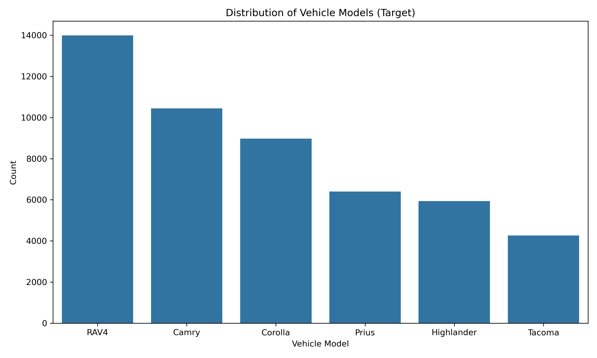
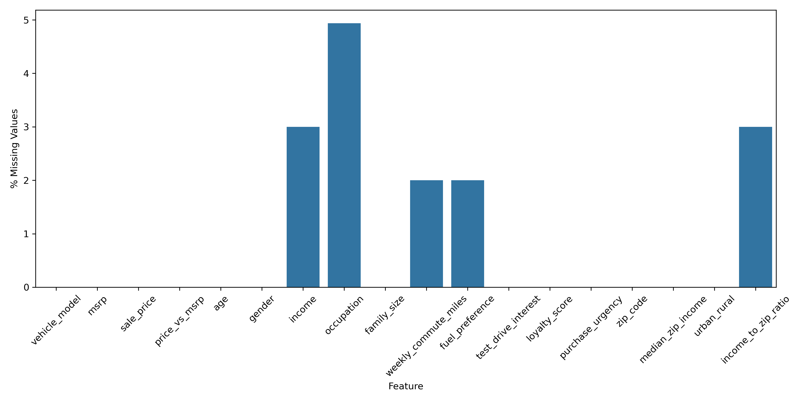
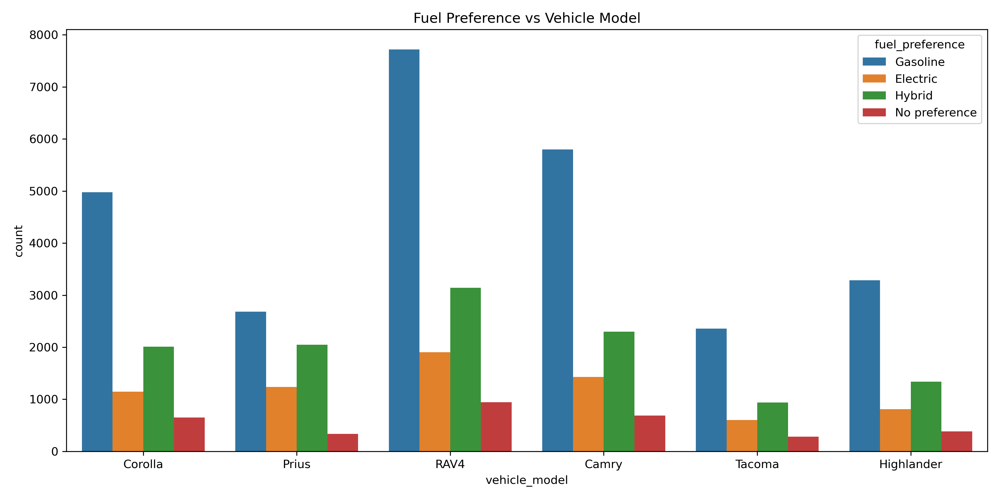
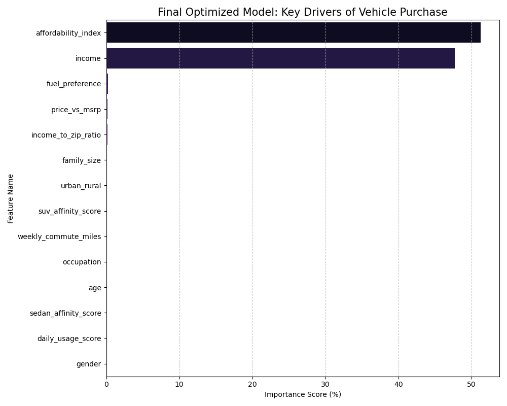
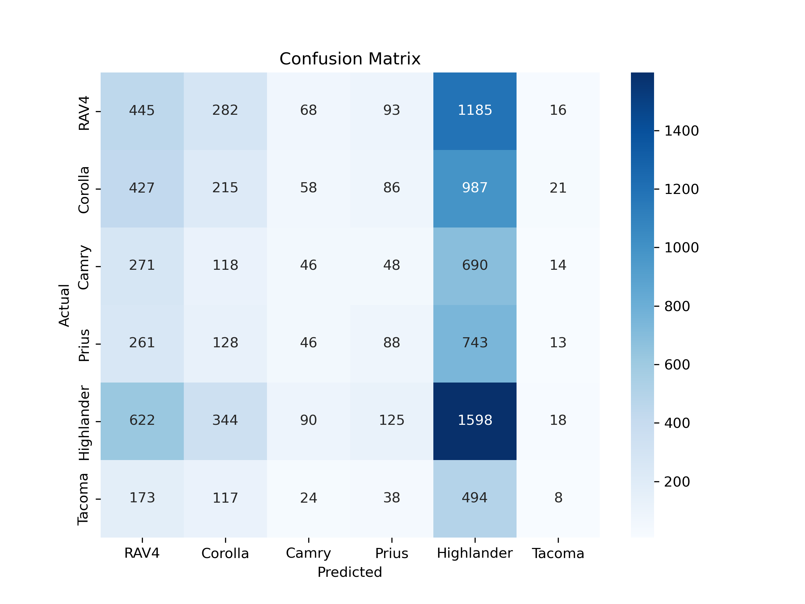
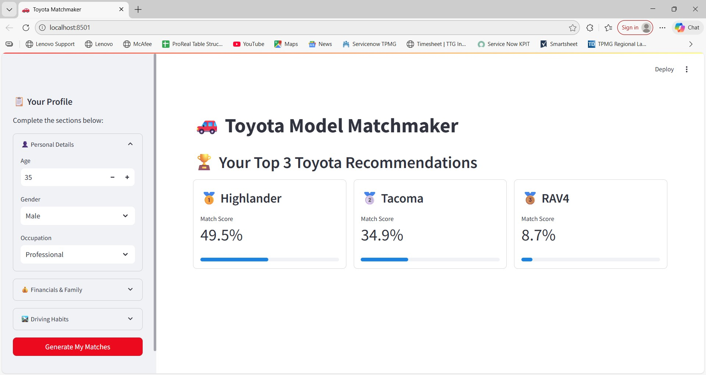
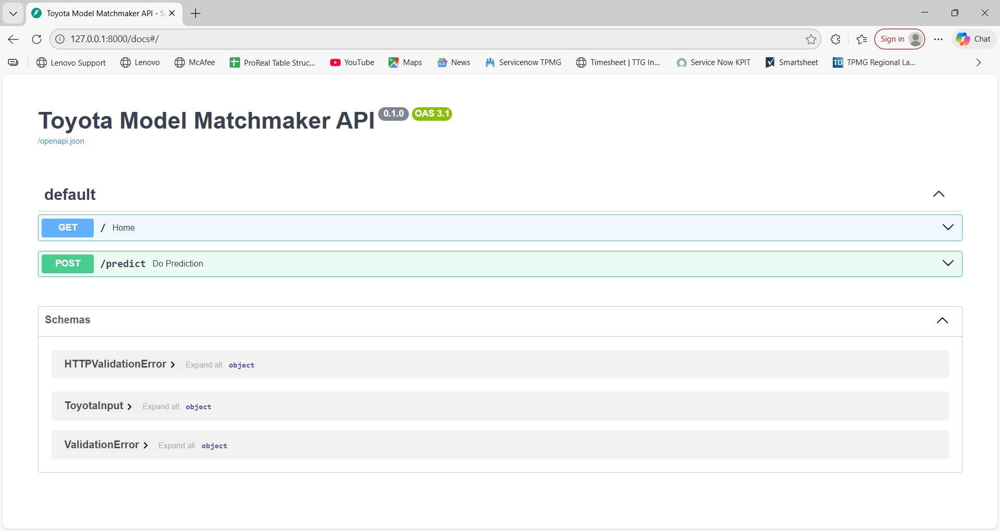

# 🚗 Capstone Project: Predicting Toyota Vehicle Purchases

**Author:** Archana Rajadnya  
**Course:** UC Berkeley Executive Education: Professional Certificate in Machine Learning and Artificial Intelligence

---

### 📌 Executive Summary
This project explores customer demographic, financial, and behavioral data to predict which Toyota vehicle model a customer is most likely to purchase. By analyzing factors such as income, family size, and commuting habits, the system provides a data-driven diagnostic tool to assist dealerships in inventory and sales planning. In testing, the final **Tuned CatBoost** model achieved a **96% accuracy rate**, transforming traditional sales recommendations into a personalized, predictive process.

---

### 🎯 Problem Statement
Automotive dealerships often struggle with "mismatched" leads where customers are shown vehicles that do not fit their budget or daily utility needs, leading to longer sales cycles.  
* **Goal:** Build a predictive engine to profile customers and suggest the most compatible Toyota model.
* **Challenges:** Capturing complex behavioral logic, such as choosing an SUV versus a sedan.
* **Benefits:** Faster sales, optimized inventory management, and personalized marketing.

---

### ❓ Model Outcomes & Predictions
* **Learning Type:** Supervised Learning.
* **Problem Type:** Multi-Class Classification.
* **Expected Output:** Identification of the correct vehicle model (Camry, Corolla, RAV4, Prius, Tacoma, Highlander).

---

### 📊 Data Acquisition
The dataset represents 50,000 potential buyers and was acquired to provide multiple demographic, financial, and behavioral signals for modeling.

  
*Figure 1: Visualization of the vehicle categories used to assess the data's potential for the classification task.*

---

### 🧹 Data Preprocessing & Preparation
To ensure high-quality modeling, the following cleaning steps were documented:
* **Cleaning:** Statistical imputation and duplicate removal were used to ensure the data was free of missing values and inconsistencies.

  
*Figure 2: Data assessment verifying the successful removal of missing values prior to modeling.*

* **Encoding:** Categorical variables were transformed through necessary encoding steps for machine learning compatibility.
* **Data Splitting:** The data was split into **Training** and **Test** sets to validate performance on unseen data.

---

### 🔍 Exploratory Data Analysis (EDA)
EDA was conducted to identify relationships between variables and the target vehicle models.

  
*Figure 3: Income distribution trends demonstrating financial separation between segments.*

  
*Figure 4: Analysis of commuting patterns across different vehicle models.*

  
*Figure 5: Comparison of customer fuel preferences per vehicle model.*

---

### 🤖 Modeling
The project evaluated several supervised machine learning algorithms to solve the defined problem statement:
* **Baseline Model:** Random Forest Classifier.
* **Champion Model:** **CatBoost**, selected for its superior ability to handle complex categorical features and lifestyle interaction signals.

---

### 📈 Model Evaluation
Multiple classification models were considered to determine the most optimal solution for this problem.

#### **Selection of Metrics**
* **Accuracy:** Chosen to provide a global measure of correctly predicted purchases across the test set.
* **Macro F1-Score:** Selected to ensure the model performs reliably across all classes, including niche models like the Tacoma and Prius, without being biased toward high-volume sellers.

**Final Performance Summary:**
| Metric | Random Forest (Baseline) | **CatBoost (Champion)** |
| :--- | :---: | :---: |
| **Global Accuracy** | 88.00% | **96.00%** |
| **Macro F1-Score** | 0.87 | **0.96** |

  
*Figure 6: Key drivers identified by the final model, showing the dominance of the Affordability Index.*

  
*Figure 7: Evaluation of the baseline model performance across vehicle segments.*

---

### 🚀 Live Interface & API
The project includes deployment-ready components for real-world dealership use.

#### **Streamlit Dashboard**
The interactive UI allows sales teams to input customer profiles and receive immediate vehicle recommendations.


*Figure 8: The live Streamlit application interface.*

#### **FastAPI Backend**
The backend API enables raw predictions and seamless integration with existing CRM systems.


*Figure 9: The FastAPI Swagger documentation for high-speed model predictions.*

---

### 📂 Project Structure
```text
├── CapstoneProjectEDA-checkpoint.ipynb
├── README.md
├── app.py (Streamlit UI)
├── main.py (FastAPI Backend)
├── cat_features.pkl
├── label_encoder.pkl
├── toyota_model.pkl
├── images/
│   ├── feature_importance.png
│   ├── feature_importance_for_prediction.png
│   ├── confusion_matrix_baseline_model.png
│   ├── income_vs_vehicle_models.png
│   ├── vehicle_models.png
│   ├── fuel_pref_vs_vehicle_models.png
│   ├── missing_values_per_column.png
│   ├── weekly_commute_vs_vehicle_models.png
│   ├── Toyota_Model_Matchmaker_UI.jpg
│   └── Toyota_Model_Matchmaker_API.jpg
├── data/
│   └── toyota_50k_synthetic.csv
└── requirements.txt
