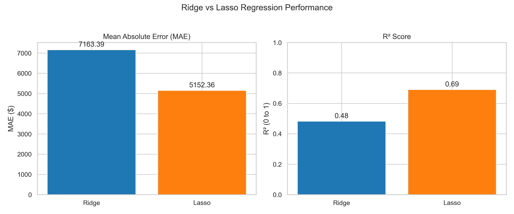
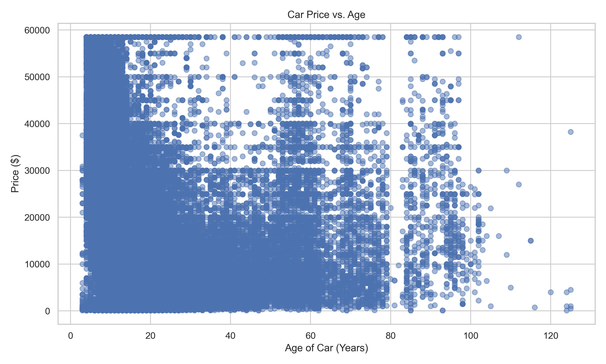

# What Drives the Price of a Car?

## Overview

This project builds a machine learning model to predict the price of used cars and provides actionable insights to a used car dealership. The goal is to identify the most influential features affecting a car's price, helping the dealership optimize its pricing strategy and inventory selection.

The project follows the **CRISP-DM** (Cross-Industry Standard Process for Data Mining) framework, a standard in the data science industry.

---

## Dataset Details

The dataset, `vehicles.csv`, is a cleaned and sampled version of a larger dataset from Kaggle containing over 3 million used car listings. The dataset contains **426,880 entries** and includes the following features:

* `id`: Unique identifier for the listing.
* `region`: The geographical region of the listing.
* `price`: The target variable, or the price of the car.
* `year`: The year the car was manufactured.
* `manufacturer`: The car's manufacturer.
* `model`: The specific model of the car.
* `condition`: The car's reported condition.
* `cylinders`: The number of cylinders in the engine.
* `fuel`: The type of fuel the car uses.
* `odometer`: The mileage of the car.
* `title_status`: The legal title status of the car.
* `transmission`: The type of transmission.
* `VIN`: Vehicle Identification Number.
* `drive`: The drivetrain type (e.g., 4wd, rwd, fwd).
* `size`: The size class of the car.
* `type`: The vehicle body type (e.g., sedan, SUV).
* `paint_color`: The color of the car.
* `state`: The state where the car is listed.

---

## CRISP-DM Framework

The project follows the CRISP-DM framework to ensure a structured and systematic approach.

1.  **Business Understanding:** The project's business objective is to help a used car dealership understand what factors drive car prices. The goal is to provide clear, actionable insights that can improve their pricing, inventory, and marketing strategies.

2.  **Data Understanding:** The analysis begins by exploring the `vehicles.csv` dataset, identifying key features, understanding their relationships, and handling missing or inconsistent values.

3.  **Data Preparation:** This involves extensive cleaning and feature engineering. It includes handling missing values, creating new features (e.g., `age`, `age^2`, and interaction terms), and encoding categorical variables using methods like One-Hot Encoding and Target Encoding.

4.  **Modeling:** Two regression models, Lasso and Ridge, are built and trained to predict used car prices. Cross-validation is used to tune hyperparameters and ensure the models' robustness.

5.  **Evaluation:** The models are evaluated based on **R-squared** and **Mean Absolute Error (MAE)**. The Lasso model proves superior, and its coefficients are used to identify the most influential features, which become the basis for the recommendations.

6.  **Deployment:** The final step involves communicating the findings to the client in a clear and understandable format, with a series of recommendations and visualizations for the dealership to inform their business decisions.

---

## Key Findings
Based on the Lasso regression model, the following key factors significantly impact a used car's price:

* **Age is the biggest factor:** The age of a car is the single most important predictor of its price. A non-linear relationship is discovered where price depreciates quickly for new cars, but the rate of depreciation slows down for older cars.
* **Odometer matters:** Higher mileage is strongly associated with a lower price.
* **Title Status is crucial:** Cars with "parts only" or "salvage" titles are worth significantly less, as expected.
* **Vehicle Type is a key driver:** Convertibles, coupes, and pickup trucks command a premium price, while types like hatchbacks and buses are associated with a lower price.

---

## Model Performance

The final model is a **Lasso regression model**, which outperformed a Ridge regression model on this dataset.

The plots comparing the performance of your Lasso and Ridge visually demonstrate why the **Lasso** model was the better choice for this project.

### Model Performance Comparison:

* The **Mean Absolute Error (MAE)** chart shows that the Lasso model's predictions are, on average, over **$2,000 closer** to the actual price of a car than the Ridge model's predictions. This is a significant difference for the dealership.
* The **R-squared** chart confirms that the Lasso model (0.69) explains **more of the variance** in car prices than the Ridge model (0.48), making it a more reliable and powerful tool for prediction.

## Key Price Drivers

### The Coefficient Chart: 
While the overall model performance metrics are strong, the true value of this analysis lies in understanding **what** the model learned. The Lasso model's ability to select the most important features allows us to pinpoint the specific factors that have the biggest impact on a car's price.

The chart below visualizes the coefficients for each feature. The length of each bar indicates how much a feature influences the price, while the direction (left or right) shows whether it increases or decreases the price. This plot is a powerful tool for inventory and pricing decisions.

* **The Biggest "Price Killers":** As expected, the two largest negative factors are a car's **age** and **odometer reading**. The model's coefficients confirm that these are the most significant depreciation factors.
* **The "Price Boosters":** Conversely, certain vehicle types and conditions have a strong positive effect. For instance, a car's `type_convertible` has a positive coefficient, indicating that these vehicles command a premium in the used car market.
* **The Non-Linear Story:** The presence of both `age` and `age^2` with opposing coefficients perfectly captures the non-linear depreciation curve, showing a sharp initial drop in value that flattens out over time.

***

### Age: The Relationship to Price

Age is the single most influential factor in a vehicle's price, and the relationship is a non-linear one. A simple linear model would fail to accurately capture the true dynamics of automotive depreciation. To address this, the model incorporates a quadratic term (`age^2`), which allows it to model a more complex and realistic depreciation curve.

The scatter plot below visually demonstrates this relationship and provides validation for the model's structure.

* **Initial Depreciation:** For new vehicles, a steep decline in price is observed. This rapid depreciation is common in the automotive market, as vehicles lose significant value in their first few years of service.
* **Decelerating Depreciation:** As a vehicle ages, the rate of depreciation decelerates, and the price curve begins to flatten. This indicates that older vehicles lose value at a slower rate than newer ones.
* **Appreciation for Vintage Vehicles:** For the oldest segment of the data, the model correctly identifies a subtle positive trend. This phenomenon is likely due to the presence of classic and collector's cars, which can appreciate in value over time.

This analysis not only confirms the validity of the `age^2` feature but also provides a clear, data-driven explanation of the complex relationship between a vehicle's age and its market price.

---
## Recommendations for the Dealership

Based on these findings, the following recommendations are provided:

1.  **Prioritize Newer Vehicles:** Focus on acquiring a younger fleet, as age is the strongest negative predictor of price.
2.  **Stock High-Value Vehicle Types:** Increase inventory of convertibles, coupes, and pickup trucks, as they command a premium and are highly profitable.
3.  **Be Cautious with Titles:** Avoid purchasing cars with "parts only" or "salvage" titles, as these vehicles have a drastically reduced value.

---

## Limitations

The model is not perfect. The **31% of unexplained variance** in the data suggests that other factors not included in the dataset could influence price. These might include:

* Maintenance history
* Cosmetic condition (e.g., dents, scratches)
* Specific optional features (e.g., sunroof, premium sound system)
* Unique regional market trends

Further improvements could be made by collecting this additional data or exploring more complex models like a Random Forest or Gradient Boosting Regressor.
